# 스마트팩토리를 도입하는 이유(회사의 입장)
---  
- 스마트팩토리의 도입 목적
- 스마트팩토리를 도입 효과
- 시범라인의 도입 사유 

### 스마트팩토리의 도입 목적
---  
1. 스마트팩토리 구축은 공급자 중심이 아닌 `사용자 입장`에서의 재개편이 필요하다.
2. __중견기업__ 이상의 스마트팩토리 도입 목적은 `원가절감`이다.
3. `사용자 중심`의 공장이란 `투자자본수익률(ROI : Return of Investment)` 관점으로 보아야 된다는것을 의미한다.
4. 기업에 특징에 맞는 `수용 가능한 표준화`를 추구하는것이 진정한 스마트 팩토리

| 공급자 중심 | 사용자 중심 |
| :--------: | :--------: | 
|`학술적 / 개념적`|`실질적/실용적`|
|`정책주도`|`가치중심`| 
|`ICT 기반`|`융합 기반`| 
|`급진적 접근`|`점진적 접근`| 
|`엄격한 표준화`|`수용적인 표준화`|   

### 스마트 팩토리를 도입하는 이유  
---
>1. 기존에 어렵다고 생각한 `기술 부족`과 `비용 부담` 문제가 __ICBAM(IoT,Cloud,Big Data,Altificial Intelligent,Mobile)__ 기술 발달로 인해 해소되면서 스마트 팩토리 구현은 실현가능한 현실로 다가옴.  
>2. 스마트팩토리는 제조기업의 기본 경쟁력인 __QCD(Quality,Cost,Delivery) 관점에서 개선을 위해 도입__ 함  

> __※ 스마트팩토리 도입으로 인한 해결 요소__  
> - 과도한 재고와 이로 인한 가격 인하, 그리고 제품 가치의 하락
> - 정확하지 못한 납기와 이로 인한 고객의 수요 대응 부족
> - 낮은 자산 운용율
> - 잘못된 제품 구성으로 인한 수익의 하락
> - 빈번한 재고 고갈과 이로 인한 급배송
> - 긴급 수요에 의한 부적할한 공급 관련 대응
> - 복잡해져 가는 제품 구성과 짧아지는 수명주기
> - 단방향적인 계획 능력과 이로 인한 공급망 전체 최적화의 어려움

>__3. 제조라는 본연의 경쟁력 확보와 새로운 사업기회의 발판__  
> 사례의 대표적인 회사인 __GE(General Eletric)__ 는 기존 항공엔진 및 발전터빈 등을 주력제품으로 판매하고 있었으나, __`엔진에 센서를 부착하고 데이터를 수집해 분석 플랫폼`__ 을 만들어 고장을 사전 예지해 고객에게 알려주는 서비스로 새로운 __` Predix`__ 라는 SW를 창출하여 SW기업으로 변모 및 이미지 탈피를 선언하였다.  

### 시범라인의 도입 목적
--- 
>1. 시범라인은 자사에서 직접 __`스마트팩토리의 표준화`__ 를 제시하기 위해 도입하는 __`가이드라인 이자 방향타`__ 이다.   
>2. 자사에 도입된 시범라인은 __`스마트팩토리 솔루션`__ 의 토대이며, 이를 바탕으로 __`솔루션 영업 인프라 확보와 시범기술과 마케팅으로 활용 해 자사 내 성장동력 확보를 얻는데 목적으로 한다.`__   

#인공지능 그리고 머신러닝과 딥러닝
---
### AI > Machine Learing > Deep Learning
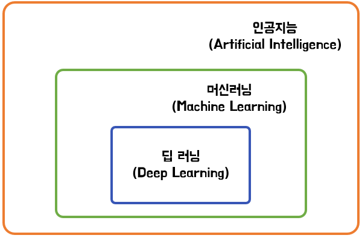

>__※ 인공지능(AI)__
>인간이 지닌 지적 능력을 인공적으로 구현한것을 모두 인공지능이라 일컫음. 

>__※ 머신러닝(Machine Learing)__
>"기계학습"으로  기계가 직접 데이터를 학습 함으로서, 그 속에 숨겨진 일련의 규칙성을 찾음. 우리가 가지는 사례 형식의 데이터를 컴퓨터가 학습해, 그를 기반으로 새 데이터를 평가, 예상하고 이를 우리가 활용 할 수 있게 함.  

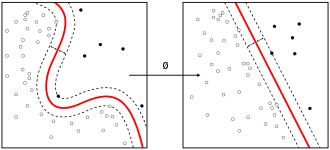

예를 들면, 감기 걸린 환자들의 체온과 건강한 사람의 체온 데이터를 컴퓨터에게 학습(메모리에 저장) 한 후 특정 체온을 제시 할 때, 그 사람이 감기에 걸렸는지 여부를 판독(알고리즘에 의한 결론)으로 판독하게 하는것이 대표적인 기계 학습의 예임.

>머신러닝 알고리즘 목록
>+ 선수지식으로 __`베이즈 이론`__ 을 요구
>- __모형화의 대표적 알고리즘__
>   + 인공 신경망
>   + 결정 트리
>   + 유전 알고리즘
>   + 유전자 프로그래밍
>   + 가우스 과정 회귀
>   + 선형 분별 분석
>   + K 근접 이웃
>   + 퍼셉트론
>   + 방사 기저 함수 네트워크
>   + 서포트 벡터 머신
>
>- __모수 추정 알고리즘__
>   + 동적 프로그래밍
>   + EM 알고리즘

해당 알고리즘을 적재적소에 어떻게 활용하느냐에 따라 데이터 분석 퍼포먼스가 다른 형태로 나오게 되어있다.
>- 접근 방법별 알고리즘
>   + 결정트리 학습법
>   + 연관규칙 학습법
>   + 인공신경망
>   + 유전 계획법
>   + 귀납 논리 계획법
>   + 서포트 벡터 머신
>   + 클러스터링
>   + 베이즈 네트워크
>   + 강화 학습법
>   + 표현 학습법
>   + 동일성 계측 학습법

>__※ 딥러닝(Deep Learing)__
>일반적인 것들은 기계학습의 일부로 대부분 것들이 비슷하나 기계학습과 구분되는 두가지 큰 특징을 지님

>1. 데이터의 특징을 사람이 추출하지 않는다(스스로 결정)
>2. 주로 인공신경망 구조를 사용하여 __학습__ 한다.

###머신러닝을 통한 개와 고양이 분류
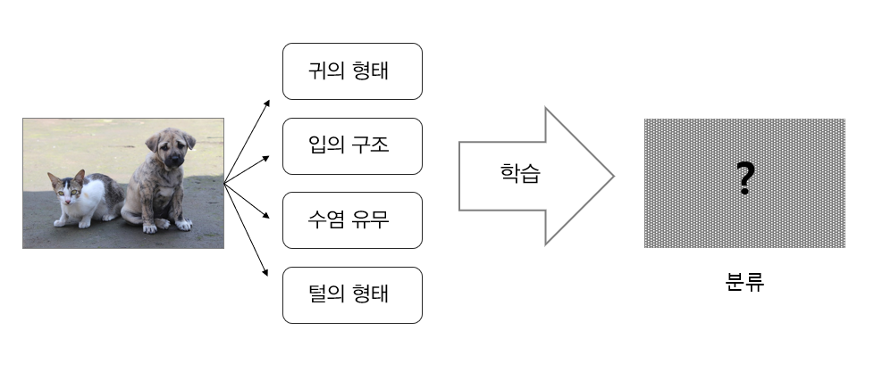

###딥러닝 통한 개와 고양이 분류
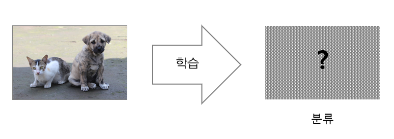

> 딥러닝 알고리즘 목록
> - 딥러닝(심층학습)
>   + 심층 신경망(DNN)
>   + 합성곱 신경망(CNN)
>   + 순환 신경망(RNN)
>   + 제한 볼츠만 머신(RBM)
>   + 심층 신뢰 신경망(DBN)
>   + 심층 Q-네트워크(Deep Q-Networks)

# Industry 4.0 : What and Why?
---
__`Industry 4.0`__  

>과거 세대부터 지금까지 산업은 지속적으로 변화되어 왔으며, 자동화시대를 지나 IT 기술의 발달이 무어의 법칙에 따라 HW 성능이 진화하면서 뛰어난 퍼포먼스를 내는 SW가 등장하기 시작함.  

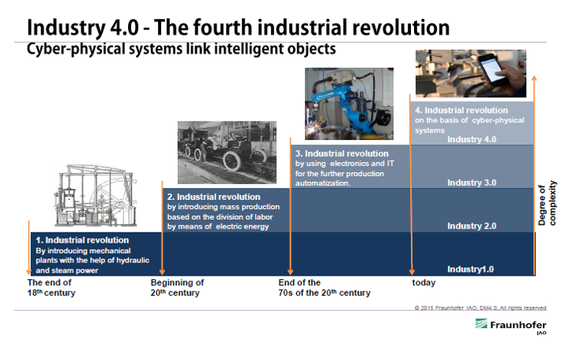  
>이에따라, 등장한것이 IOTPS(Internet of Thing, People, Service)가 확립되어 가치/비지니스 시장 확대에 주목하기 시작했으며, 사람들은 실재와 가상을 연동하는 기술인 CPS(Cyber Physical System)의 영역까지 확보하고자 노력하고 있음.  

## Why Industry 4.0?

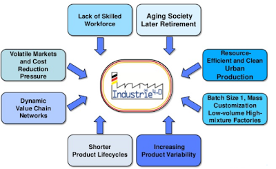  

>1. 숙련된 작업자를 찾기 어렵다
>2. 은퇴자 수의 증가
>3. 자재 관리효율과 생산효율 향상
>4. 다양한 생산품에 대한 대응  
>5. 제품 수명주기가 짧아짐
>6. 엄청난 가치 체인 네트워크

## Industry 4.0에 대한 독일의 생각  
독일의 Industry4.0 실현방향에 대한 의견
> bitkom - 독일 전자산업통신 협회
> VDMA - 독일 공학 기술자 조합
> ZVEI - 독일 전자전기산업 협회  

Industry4.0 보급/확산이 핵심임을 강조하며, road map을 하기와 같이 규정 및 정의(표준화) 하였음.  

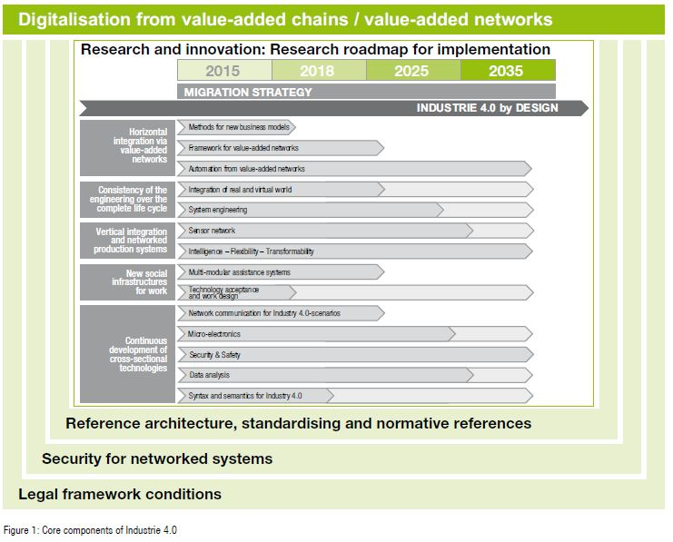  

각 기관은 제도적 규제 및 보안 시스템이 확립된 조건하에 표준화된 architecture를 제정하고, 표준화된 architecture 구성하는 주요 항목별 구현 로드맵을 제시하였음.   

>* 상기 그림은 5가지 항목에 대한 많은 요소기술을 Gruoping 하고 있음.  
>* 각 Architecture에 대한 정의는 하기 테이블에서 정리   

| Architecture | 정의 |
| :--------: | :--------: | 
|`Horizontal Integration via value creation networks`|원료 공급자 - 부품 제작자 - 완제품 제작자 - 유통 관련 업자 등의 협업이 유기적으로 이뤄질 수 있도록 하는 것.|
|`End-to-End nature of engineering over the entire life cycle`|제품의 설계 시점에서 활용되는 데이터 항목과 실제 양산 활용 데이터 항목의 연동 및 일관성 확보의 영역| 
|`Vertical integration and networked production systems`|생산 현장의 4M(Man, Machine, Method, Material)과 1E(Environment) 사이의 유기적인 연계(CPS + networking in shop floor level) 및 상위 시스템(기업 정보 시스템 등) 사이의 연동/협력을 실현하는 것| 
|`New Social Infrastructures for work`|Industry 4.0이 실현된 환경 하에서 근무하는 근로자들이 더 나은 조건에서 일하도록 하는 기술들의 집약(VR기반 훈련,multi-modal Interface with machine)| 
|`Continual development of cross-sectional technologies`|앞에서 언급된 architecture들이 서로 유기적으로 상호작용이 잘되도록 개발이 진행되는 영역|  

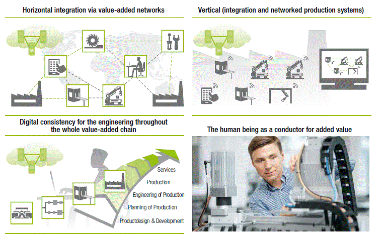  

#### 1. Horizontal Integration의 정의  
---
> `Value chain(정보화)`를 구성하는 다양한 조직 간 IT system의 통합을 통해 다양한 value chain/process의 구축/실행을 지원하는 행위  

#### 2. Horizontal Integration의 실현을 위해 필요한 요소 기술  
---
>__"사람,사물,서비스"__ 가 유기적으로 연결&결합되는 __돈 벌 기회__ 가 무궁무진함으로 __`먹거리`__ 를 만들어 나가는데 집중해야 됨.  

>`Value Chain Network(원재료에서 완제품 전달까지 이르는 공급망)`을 구성할 때 편하게 구성 할 수 있는 기술, 더 나아가 구성 및 운요에 있어 일련의 자동화를 지원하는 기술  
#### 새 비지니스 모델 수립을 위한  요소기술 내역

| 요소 기술 | Description |
| :--------: | :--------: | 
|`Method`| 어떤 market에서, 어떤 파트너들과 함께 수익을 창출 할 것인가? |
|`Value Networks Framework`|기업들은 제품 별 공급망 구성을 보고 자신이 어느 단계에 들어갈 수 있는지 파악할 수 있어야 함| 
|`Value network 자동화`|어떻게 기업의 정보 시스템 사이에 정보 교환이 원활하게 할것인가?(표준화된 I/F 기반)| 

#### 3. Industry 4.0 에서의 Entire Life Cycle
---
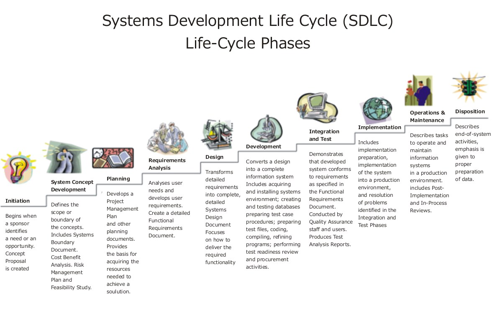  

##### End-to-end Engineering ?

>제품 설계단게 뿐 아니라 개발, 운용/유지보수 단계에서 발생한 모든 정보/데이터, 노하우 등이 곧바로 설계 활동에 반영이 되어 제품의 전 라이프 사이클에 걸쳐 유기적인 협업하에 설계 활동이 이뤄지는것  

##### End-to-end Engineering에 필요한 요소기술

###### 3.1 Real world와 virtual word의 통합  
실세계에서 다루는 object에 대한 distal copy(모델)을 만드는 작업 진행  

이는 Labview Simulation과 유사함. Labview는 Sensor I/O를 지원하고, 물리적으로 연동된 Sensor/Controller를 컴퓨터 상에서 Model로 표현이 가능하며, 해당 Model들을 활용해 사용자가 의도한 작업을 수행함.  

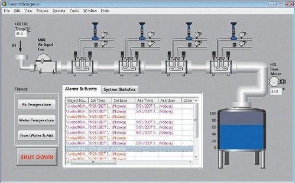  
__Labview에서 사용한 SCADA의 예__

> 단순히, modeling에서 프로그램이 끝나는 것이 아닌, 데이터 통합 작업이 수반되어야 함. 제품 개발/제품 생산 단계에서 활용되는 데이터 항목들은 다를지어도 연계되는 항목을 고려해, 생산/설계 분야에서 협업이 이뤄지려면 작업진행을 꾸준히 해주어야 됨  

###### 3.2 System Engineering

시스템 엔지니어링은 시스템 개발시 생명 주기 전 관점에서 고려되는 모든사항을 반영하고, 다분야/학제 간 체계적이고 일관된 협력을 지향하는 방법론.  

System Engineer들 사이에서는 이러한 개발과정을 `V-model`로 표시하고, 개념 스케치 및 요구사항 발굴 시 System life cycle 전체 관점을 염두해 두고 진행하게 됨.  

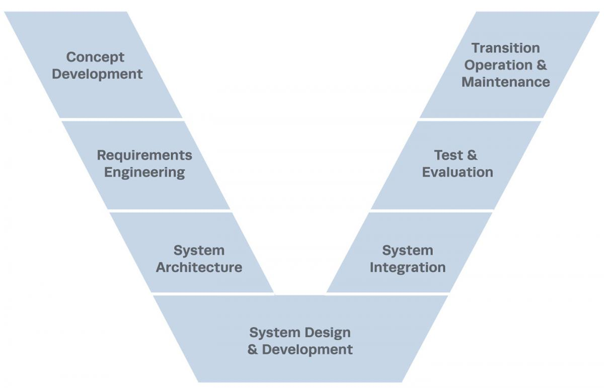  

`ISO15288` 표준에서 제시되는 생명주기에 대한 활동은 위 V-model에 상에서 수행되는 행동들을 정리함  

>각 Life Cycle에 대한 규격은 시스템엔지니어링 표준인 `ISO15288, EIA632, IEEE1220`을 참조해서 진행하면 될것

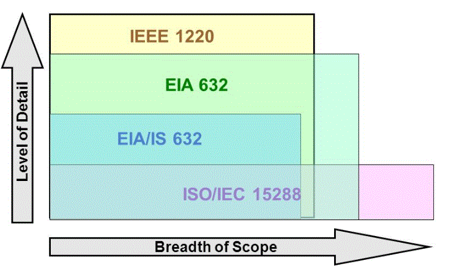  

| 표 준 | Description |
| :--------: | :--------: | 
|`ISO 15288`| 전체 life cycle에 대한 내용을 두루두루 보고 싶다 |
|`IEEE 1220`|설계 단계 내용을 상세하게 보고 싶다| 
|`EIA 632`| `ISO 15288`과`IEEE 1220` 중간 정도의 구성| 
